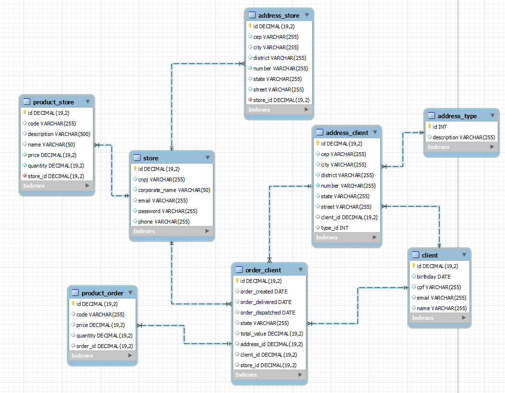

## Tecnologias

- [Spring Boot](https://spring.io/projects/spring-boot) - Framework de Desenvolvimento para a Linguagem Java.

- [Lombok](https://projectlombok.org/) - Biblioteca Java focada em produtividade e redução de código boilerplate que, por meio de anotações adicionadas ao nosso código, ensinamos o compilador (maven ou gradle) durante o processo de compilação a criar código Java.

- [JUnit5](https://junit.org/junit5/) - Framework facilita a criação e manutenção do código para a automação de testes com apresentação dos resultados.

- [JaCoCo Java Code Coverage](https://www.eclemma.org/jacoco/) - JaCoCo é uma biblioteca de cobertura de código gratuita para Java, que foi criada pela equipe EclEmma com base nas lições aprendidas com o uso e integração de bibliotecas existentes por muitos anos.

- [Mockito](https://site.mockito.org/) - Estrutura de teste de código aberto para Java liberada sob a licença MIT. A estrutura permite a criação de objetos duplos de teste em testes de unidade automatizados com o objetivo de desenvolvimento orientado a teste ou desenvolvimento orientado a comportamento.

- [MySQL](https://www.mysql.com/downloads/) - Banco de dados.

- [Hibernate](https://hibernate.org/) - Framework para persistência de dados. (ORM)

- [JPA](https://hibernate.org/orm/) - Especificação do Java que dita como os Frameworks ORM devem ser implementados.

- [Docker](https://www.docker.com/) - Plataforma open source que facilita a criação e administração de ambientes isolados. Ele possibilita o empacotamento de uma aplicação ou ambiente dentro de um container, se tornando portátil para qualquer outro host que contenha o Docker instalado.

- [Swagger](https://swagger.io/) - Essencialmente uma linguagem de descrição de interface para descrever APIs RESTful expressas usando JSON.

- [RabbitMQ](https://www.rabbitmq.com/) - É um servidor de mensageria de código aberto (open source) desenvolvido em Erlang, implementado para suportar mensagens em um protocolo denominado Advanced Message Queuing Protocol (AMQP). Ele possibilita lidar com o tráfego de mensagens de forma rápida e confiável, além de ser compatível com diversas linguagens de programação, possuir interface de administração nativa e ser multiplataforma.

## Sobre o Projeto

Para criar e alterar e buscar endereços e pedidos é necessário que o cliente esteja logado, o mesmo é validado por Bearer Token, autenticação JWT. Produtos podem ser buscados livremente, porém seu cadastro e alteração exige login.

A API de loja consiste num microserviço de cadatro de lojas, produtos e endereços. Uma loja pode possuir vários produtos, vários pedidos e apenas um endereço. Todo cadastro, alteração e delete de lojas ou produtos refletirá na api do cliente, que recebe os dados via RabbitMQ. A loja também recebe os pedidos via menssageria e pode alterar seu estado, quando necessário, para ENVIADO, informando o cliente que o mesmo foi enviado.

## Modelagem do banco de dados

